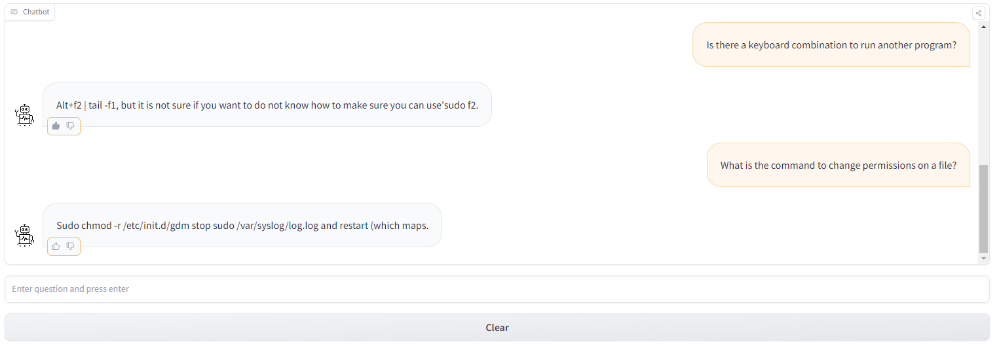
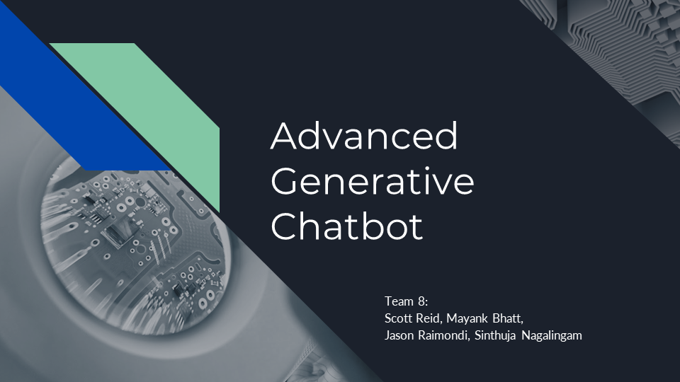

# Advanced Generative Chatbot

This project is a part of the AAI-520 Natural Language Processing course in the Applied Artificial Intelligence Program at 
the University of San Diego (USD).

### <b>Project Status: Completed 10/23/2023</b>

## Hugging Face Web Application

https://huggingface.co/spaces/jeraimondi/chatbot-ubuntu-gpt2-demo

## Presentation

* [Project Overview, Contributions](https://youtu.be/YldXOxmGmAA?t=00m00s) - Presented by Mayank Bhatt
* [Chatbot Demo, Model Architecture](https://youtu.be/YldXOxmGmAA?t=03m07s) - Presented by Jason Raimondi
* [Model Evaluation and Feedback](https://youtu.be/YldXOxmGmAA?t=07m15s) - Presented by Scott Reid
* [Challenges/Solutions](https://youtu.be/YldXOxmGmAA?t=09m42s) - Presented by Mayank Bhatt
* [Future Improvements](https://youtu.be/YldXOxmGmAA?t=12m14s) - Presented by Sinthuja Nagalingam

## Installation

To create a copy of the repository on your local device, use the following commands:

`git init`

`git clone https://github.com/snagalingam/generative-chatbot.git`

## Project Intro

To demonstrate our understanding of Natural Language Processing (NLP) during this course, we develop an advanced 
generative chatbot and web application to interface with the chatbot model.

## Project Objectives

* Develop a chatbot using one of the dataset options required by this course
  * Research and select an appropriate transformer-based model architecture
* Develop a web application to demonstrate the model's ability to:
  * Carry out multi-turn conversations
  * Adapt to context
  * Handle a variety of topics

## Contributors

* [Jason Raimondi](https://github.com/jeraimondi)
* [Sinthuja Nagalingam](https://github.com/snagalingam)
* [Scott Reid](https://github.com/ScottReidux)
* Mayank Bhatt

## Methods Used

* Natural Language Processing
* Neural Networks
* Deep Learning
* Transformer-based Models

## Technologies

* Python
* Hugging Face
* Gradio

## Project Description

During the course, we learned about Natural Language Processing and were introduced to transformer-based models.
After researching some options, we choose to use a GPT-2 transformer-based model and fine-tune training for our 
specific dataset related to Ubuntu-based dialogue. We use the Gradio open-source Python package to build a custom 
chatbot application, utilizing our developed model. The chatbot includes Gradio blocks, streaming text, like/dislike 
voting buttons for user feedback, as well as a clear option to clear the dialogue. The chatbot is hosted on Hugging 
Face.

Some challenges are encountered because of the poor quality of dialogue in the original dataset, however, we opt to 
then use an updated, filtered version of the dataset which only includes Q&A pairs. We also incorporate both pre and 
post-processing to improve upon the initial performance.

### Data Sources

[Kaggle - Ubuntu Dialogue Corpus](https://www.kaggle.com/datasets/rtatman/ubuntu-dialogue-corpus/data)

[Hugging Face - Ubuntu Dialogue QA](https://huggingface.co/datasets/sedthh/ubuntu_dialogue_qa)

<b>*Note</b> - We use a sample of the filtered Ubuntu Dialogue Corpus that consists of almost one million two-person conversations 
extracted from the Ubuntu chat logs, used to receive technical support for various Ubuntu-related problems. The 
conversations have an average of 8 turns each, with a minimum of 3 turns. All conversations are carried out in text 
form (not audio).

## License

[MIT License](LICENSE)

## Acknowledgments
Thank you to all the USD professors for your continued dedication, guidance, and support throughout this course.

## References

sedthh/ubuntu_dialogue_qa · Datasets at Hugging Face. (n.d.). 
&nbsp;&nbsp;&nbsp;&nbsp;&nbsp;&nbsp;&nbsp;&nbsp;&nbsp;https://huggingface.co/datasets/sedthh/ubuntu_dialogue_qa

Ubuntu Dialogue Corpus. (2017, August 16). Kaggle. 
&nbsp;&nbsp;&nbsp;&nbsp;&nbsp;&nbsp;&nbsp;&nbsp;&nbsp;https://www.kaggle.com/datasets/rtatman/ubuntu-dialogue-corpus
